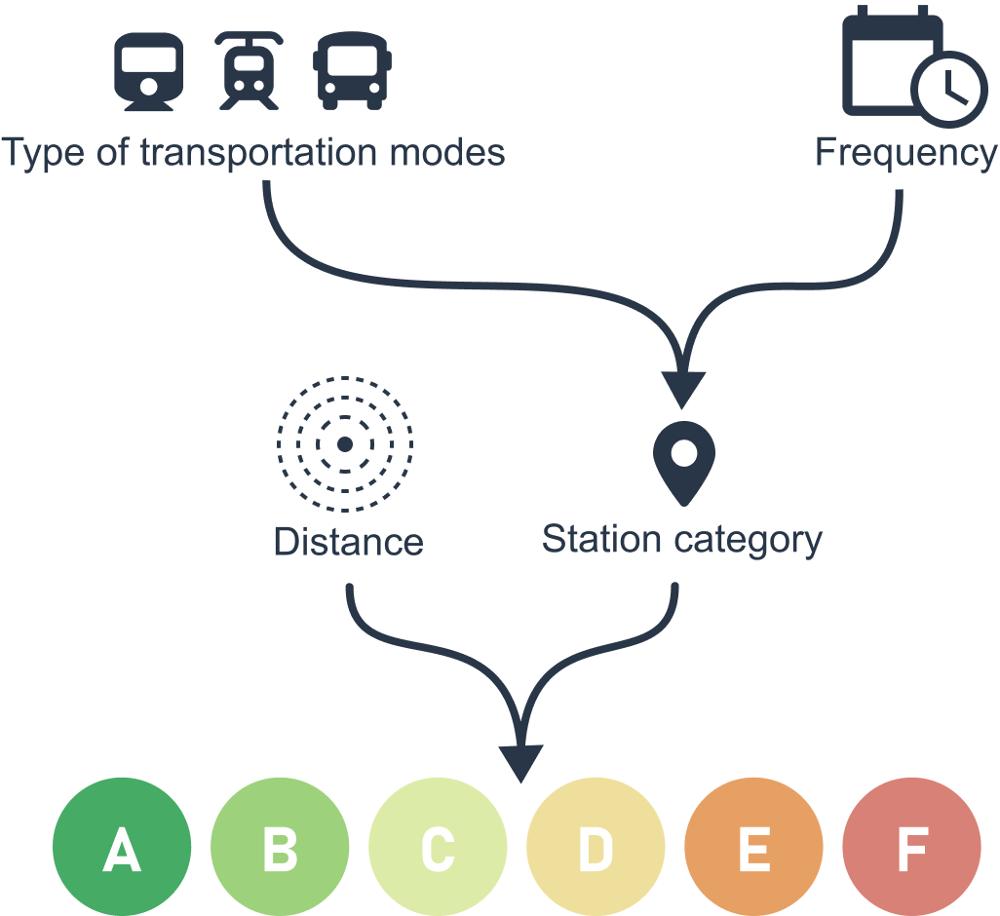

```{r setup, include=FALSE}
knitr::opts_chunk$set(warning = FALSE, message = FALSE) 
library(ggplot2)
```

# Introduction

In this tutorial we will be implementing a simple version of an "ÖV-Güteklassen"-style analysis,
where we combine service frequency and access distance to provide insight into the quality of
public transport system access. You can find more background information [here](https://goat.plan4better.de/docs/toolbox/accessibility_indicators/oev_gueteklassen).

{width="300px"}

[figure source](https://goat.plan4better.de/docs/toolbox/accessibility_indicators/oev_gueteklassen)


# Loading the packages we'll need

The main package we'll be using in this tutorial is [tidytransit](https://github.com/r-transit/tidytransit). We used it in the previous tutorial to prepare our GTFS data. This time, we'll directly use it for our analysis.

```{r}
library(tidytransit)
library(sf)
library(tidyverse)
```

# Specifying the ÖV-Güteklassen Criteria

```{r}
STOP_CAT_CRITERIA<-

tribble(~Max_Headway,~Rail, ~Bus,
        5, 1, 2,
        10, 1, 3,
        20, 2, 4,
        40, 3, 5,
        60, 4, 6,
        120, 5, 7 )

STOP_CAT_CRITERIA
```

```{r}
DIST_CLASS_CRITERIA<-

tribble(~cat,~dist,~class,
        1, 300, "A",
        1, 500, "A",
        1, 750, "B",
        1, 1000, "C",
        
        2, 300, "A",
        2, 500, "B",
        2, 750, "C",
        2, 1000, "D",
        
        3, 300, "B",
        3, 500, "C",
        3, 750, "D",
        3, 1000, "E",
        
        4, 300, "C",
        4, 500, "D",
        4, 750, "E",
        4, 1000, "F",
        
        5, 300, "D",
        5, 500, "E",
        5, 750, "F",
        5, 1000, NA,
        
        6, 300, "E",
        6, 500, "F",
        6, 750, NA,
        6, 1000, NA,
        
        7, 300, "F",
        7, 500, NA,
        7, 750, NA,
        7, 1000, NA)

DIST_CLASS_CRITERIA%>%
  pivot_wider(names_from = dist,values_from = class)
```


# GTFS preparation

-   Download data from: <https://gtfs.de/de/feeds/> - pick "Deutschland gesamt"
-   Move the zip file into the `/raw_data/` folder (saved as `latest.zip`) - **DON'T** unzip it!
- **Note: if you want to follow along without downloading anything, simply rename `/raw_data/latest_example.zip` to `/raw_data/latest.zip`**
-   We will then follow the same steps as in the last tutorial to trim the feed

```{r}
CRS_PROJECTED <- 25832
BUFFER_DISTANCE <- 5000

area <- st_read("./raw_data/munich_admin.gpkg")

area_buffered <- st_transform(area,crs = CRS_PROJECTED) # switch crs to projected 

area_buffered <- st_union(area_buffered) # join geometries 

area_buffered <- st_buffer(area_buffered, BUFFER_DISTANCE) # buffer by 5km

area_buffered <- st_transform(area_buffered,crs = 4326) # switch back to WGS84 for filtering the GTFS feed

gtfs_raw <- read_gtfs("./raw_data/latest.zip",encoding = "UTF-8") # path should point to the GTFS feed you downloaded

gtfs_filtered <- filter_feed_by_area(gtfs_raw,st_bbox(area_buffered))
```
We will do our analysis just for stops within Munich. Let's create a list of stops so that we can
easily select these.

```{r}
stops_study_area <- st_as_sf(gtfs_filtered$stops, coords = c("stop_lon","stop_lat"),crs = 4326,remove = F)

stops_study_area <- stops_study_area%>%
  st_filter(area)

stops_study_area <- stops_study_area$stop_id

```


# Calculate Stop Departures

To calculate service frequency, we will use the `get_stop_frequency()` function. This requires that we specify  `service_ids`: "an ID that uniquely identifies a set of dates when service is available for one or more routes". A more detailed look into this can be found here: <https://r-transit.github.io/tidytransit/articles/servicepatterns.html>

Tidytransit provides us with a convenient table of services by date. We will use it to find all service_ids for our chosen date of analysis.

```{r}

gtfs_filtered$.$dates_services


```

```{r}
DATE_OF_ANALYSIS <- as.Date("2026-06-03")
START_TIME <- hms("6:00:00")
END_TIME <- hms("22:00:00")

dates_services_filtered <- filter(gtfs_filtered$.$dates_services, date == DATE_OF_ANALYSIS)


dates_services_filtered
```

We will then pass this into `stop_frequencies()` and choose a duration for the analysis from 6 AM to 10 PM.

```{r}
stop_frequencies<-
  get_stop_frequency(
  gtfs_filtered,
  start_time = START_TIME,
  end_time = END_TIME,
  service_ids = dates_services_filtered$service_id,
  by_route = TRUE
)
```

We get an error because our GTFS feed is missing a `direction_id` field in the `trips` table.
This is an optional field according to the GTFS spec. 
```{r}
gtfs_filtered$trips
```

As a workaround, we'll set all `direction_id` to 0.
```{r}
gtfs_filtered$trips <- mutate(gtfs_filtered$trips, direction_id = 0)
gtfs_filtered$trips
```

```{r}
stop_frequencies<-
  get_stop_frequency(
  gtfs_filtered,
  start_time = START_TIME,
  end_time = END_TIME,
  service_ids = dates_services_filtered$service_id,
  by_route = TRUE
)

stop_frequencies
```

Lets start to clean this up. We need an average headway for each stop. To do this, we will:

- filter out stops outside of the study area
- add up all departures for each stop
- re-calculate an average headway 


To make this easier to write, we will use pipes `%>%` which pass the output of one function into the next.
This lets us read the code from the left to right. For example, the following blocks of code are equivalent:


```{r}

stop_frequencies <- filter(stop_frequencies,stop_id %in% stops_study_area)

stop_frequencies_agg_stop <- summarize(group_by(stop_frequencies, stop_id),
                                         n_departures = sum(n_departures))

stop_frequencies_agg_stop <- mutate(stop_frequencies_agg_stop,
                                      mean_headway = as.numeric(as.numeric(END_TIME-START_TIME))/n_departures)

stop_frequencies_agg_stop
```


```{r}

stop_frequencies <- stop_frequencies%>%filter(stop_id %in% stops_study_area)

stop_frequencies_agg_stop <- stop_frequencies%>%
  group_by(stop_id)%>%
  summarize(n_departures = sum(n_departures))%>%
  mutate(mean_headway = as.numeric(as.numeric(END_TIME-START_TIME))/n_departures)
  
  
stop_frequencies_agg_stop
```

# Determine Service Types 

In addition to service frequency, we also need to know what types of routes serve the stop. 

- our `stop_frequencies` table tells us which routes serve each stop 
- The `route_type` tells us what kind of service it is. It is specified in the `routes` table. 
- Let's join route information to our `stop_frequencies` table

```{r}
stop_routes <- stop_frequencies%>%
  left_join(gtfs_filtered$routes%>%select(route_id,route_type), by = "route_id")

stop_routes
```

To make it easier to interpret we can then join names using the `tidytransit::route_type_names` table

```{r}
stop_routes <- stop_routes%>%
  left_join(tidytransit::route_type_names, by = "route_type")

stop_routes
```

Let's take a look at what different route types we have
```{r}
stop_routes%>%
  count(route_type,route_type_name)
```
Since we're doing a very simple implementation of the ÖV-Güteklassen, we just need to flag if a stop 
has rail service or not. We know that Bus is indicated by `route_type == 3`. Therefore, if any of the route_types are not 3 (`!=3`), it means we have some sort of rail service.

```{r}
stop_rail_routes<-
  stop_routes%>%
  group_by(stop_id)%>%
  summarize(rail = any(route_type != 3))%>%
  ungroup()

stop_rail_routes
```

# Assigning a category to each stop

- Let's first join the rail service information to the frequency table
- Then let's convert the headway into minutes

```{r}
stop_cat<-
  stop_frequencies_agg_stop%>%
  left_join(stop_rail_routes, by = "stop_id")%>%
  mutate(mean_headway = mean_headway/60)

stop_cat
```

To join the stop criteria, we'll need to reshape the data into a long format.
```{r}
stop_cat_criteria_reshaped<-
  STOP_CAT_CRITERIA%>%
  pivot_longer(cols = c(Rail,Bus), names_to = "mode", values_to = "cat")%>%
  mutate(rail = mode == "Rail")%>%
  select(rail,Max_Headway, cat)

stop_cat_criteria_reshaped
```

- we then join the tables by rail (T/F) and where `mean_headway <= Max_Headway`
- keep the minimum (best) category
```{r}
stop_cat <-
  stop_cat %>%
  left_join(stop_cat_criteria_reshaped,
            by = join_by(rail, mean_headway <= Max_Headway)) %>%
  group_by(stop_id, n_departures, mean_headway, rail) %>%
  summarize(cat = min(cat)) %>%
  ungroup()

stop_cat
```

# Service area buffers

- with the stop category appended, we want to create circular service areas from which we will apply the class (depending on distance and stop category)

- we start by joining the stop category `stop_cat` to the stops table from the GTFS feed and add point geometry from the `stop_lon` and `stop_lat` columns
```{r}

stop_OEVGK<- gtfs_filtered$stops%>%
  right_join(stop_cat, by = "stop_id")%>%
  st_as_sf(coords = c("stop_lon","stop_lat"),crs = 4326,remove = F)

stop_OEVGK

```

- these are the distances used for classification:


```{r}
buffer_distances <- DIST_CLASS_CRITERIA$dist%>%unique()%>%sort()

buffer_distances
```


- we will buffer the stop points by each of the buffer distances
```{r}

stop_OEVGK_buffered <- list()

for(buffer_distance in buffer_distances){
  stop_OEVGK_buffered[[as.character(buffer_distance)]] <- stop_OEVGK%>%
    st_transform(crs = CRS_PROJECTED)%>% # switch to projected CRS
    st_buffer(buffer_distance)%>%
    st_transform(crs = 4326)%>% # back to WGS 84
    mutate(dist = buffer_distance)
}

stop_OEVGK_buffered
```

- lets merge all rows of the tables, each stop will now have multiple rows: one per buffer distance
- we are now able to append the final class based on the criteria we defined in `DIST_CLASS_CRITERIA`

```{r}
DIST_CLASS_CRITERIA
```

```{r}
stop_OEVGK <- bind_rows(stop_OEVGK_buffered)%>%
  left_join(DIST_CLASS_CRITERIA,by = c("cat","dist"))

stop_OEVGK
```

Before finishing, we'll clean this up by:

- flagging stops without a classification with "Z"

```{r} 
stop_OEVGK<- stop_OEVGK%>%
  mutate(class = replace_na(class,"Z")) 

stop_OEVGK 
```

- We will also dissolve polygons of the same class, to create a nice map

```{r}

stop_OEVGK_dissolved<- stop_OEVGK%>%
  group_by(class)%>%
  summarize()

stop_OEVGK_disolved
```

```{r}
ggplot()+
  geom_sf(data = stop_OEVGK_dissolved%>%filter(class != "Z")%>%arrange(desc(class)),
          aes(fill = class))+
  theme_minimal()+
    scale_fill_manual(
    values = c(
      "A" = "#1a9850",  # green
      "B" = "#91cf60",  # light green
      "C" = "#d9ef8b",  # yellow-green
      "D" = "#fee08b",  # yellow
      "E" = "#fc8d59",  # orange-red
      "F" = "#d73027"   # red
    ),
    drop = FALSE
  )+
  theme(legend.position="bottom")
```

Let's export the results so that we can work with it in QGIS.

```{r}
st_write(stop_OEVGK_dissolved,"stop_OEVGK_dissolved.gpkg",append = F)
st_write(stop_OEVGK,"stop_OEVGK.gpkg",append = F)

```
# Challenge

Apply what you've learned so far! Extend this analysis by:

1. Using network distance (isochrones) instead of Euclidean buffers to apply the classification
2. Intersecting the areas with census data to determine how many people live within each of the classes


