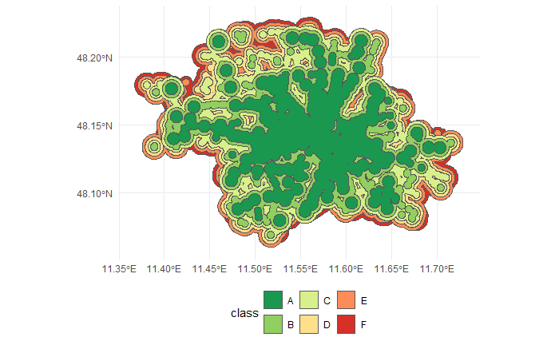

# ILUT-M tidytransit tutorial

Tutorial for Interactions of Landuse and Transport at the Technical University of Munich

In this tutorial, we implement a simple version of the **ÖV-Güteklassen**, a methodology used to assess the quality
of public transport system accessibility in [Switzerland](https://www.are.admin.ch/de/verkehrserschliessung) and [Austria](https://www.oerok.gv.at/raum/themen/raumordnung-und-mobilitaet).
A [recent study](https://www.greenpeace.de/publikationen/Methodenbericht%20%C3%96PNV-Qualit%C3%A4t.pdf) details an adaptation to the German context as well.

This tutorial builds off of the [r5r tutorial](https://github.com/bartosz-mccormick/ilutm-r5r-tutorial).
Please begin with that tutorial as some steps will not be covered in as much detail.
